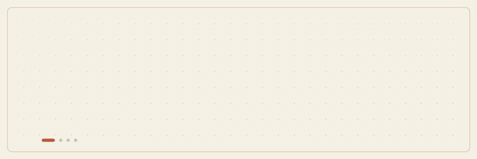

# Hey there! I'm Paulina 👋

Data Science student at **Universidad Austral** 🇦🇷. Passionate about uncovering stories and meaningful insights hidden within data through statistical analysis, data visualization, and programming.

---

### 🚀 About Me
- 🎓 **Education:** B.S. in Data Science (*Universidad Austral*)
- 💡 **Academic Interests:** Data Analysis, Data Visualization, Applied Statistics, Quantum Computing and Neuroscience
- 💬 **Current Focus:** Mastering data manipulation, exploratory data analysis (EDA), and effective visualization using Python and R.

---

### 🛠️ Tech Stack & Tools (working on it :)
- **Languages:** Python | R
- **IDEs & Environments:** VS Code | Jupyter Notebooks | RStudio
- **Libraries & Tooling:** 
  - *R:* `tidyverse` (`ggplot2`, `dplyr`, `readr`, `janitor`, `lubridate`)
  - *Python:* `pandas`, `numpy`
  - *Reporting & Version Control:* Quarto, RMarkdown, Git & GitHub

---

### 📚 Projects & Code Showcase
*Currently building my first academic data analysis projects and explorative scripts.*

- 📌 **[Academic Project / Dataset Analysis]**: Exploratory data analysis (EDA) using R / Python. *(Coming soon)*
- 📌 **Data Science Learning Journey**: A collection of notes, practice scripts, and data manipulation workflows in Python and R.

---

### 📫 Connect with Me
- ✉️ Email: paugrscovich@gmail.com
