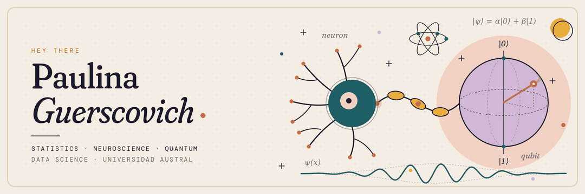
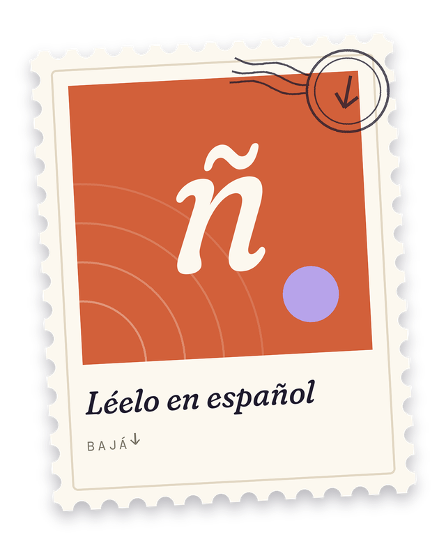

  

  
  &nbsp;&nbsp;&nbsp;
  

<i>pick a stamp · elegí un sello</i>

---

<h2 align="center">English</h2>

## .𖥔 ݁ ˖ About me

I study **Data Science** at the Faculty of Engineering of the *Universidad Austral*, in Rosario, Argentina.

Statistics is the thing that hooked me mosy: the idea that a handful of well-chosen numbers can give you a valuable insight into what is actually taking place in the messy world we live in. Down the road I aim to take that toward **neuroscience** and **quantum computing**, two fields where solid data analysis still has a lot of unexplored ground.

Outside the screen, I'm a member of the **Argentine national fencing team**, I'm always listening to music (my headphones being in my backpack is a constant), and I write: essays, fiction and the occasional post on [Substack](https://substack.com/@pauugrssco) (when inspired).

## Currently working on ⋆.ೃ࿔*:･

- Learning to wrangle and explore data in **R** (tidyverse) and **Python** (pandas, numpy)
- Practicing exploratory data analysis and, above all, clear visualization
- Writing reproducible reports with **Quarto**

## ✎﹏Tools (becoming acquainted with):

| | |
|---|---|
| **languages** | Python · R |
| **environments** | VS Code · Jupyter · RStudio |
| **R** | `tidyverse` · `ggplot2` · `dplyr` · `readr` · `janitor` · `lubridate` |
| **Python** | `pandas` · `numpy` |
| **reporting & versioning** | Quarto · RMarkdown · Git & GitHub |

## Projects .𖥔 ݁ ˖ִ🛸༄˖°.

| project | what it is | stack |
|---|---|---|
| *first EDA project* | Exploratory analysis of a real dataset (in progress) | R |
| *learning journey* | Notes, practice scripts and data-manipulation workflows | Python · R |

*More coming as I build them.*

## Reach out! 𖹭.ᐟ✷

[Mail](mailto:paugrscovich@gmail.com)

<a href="#lang">↑ back to the stamps</a>

---

<h2 align="center">Español</h2>

## .𖥔 ݁ ˖ Sobre mí

Estudio **Ciencia de Datos** en la Facultad de Ingeniería de la *Universidad Austral*, en Rosario, Argentina.

La Estadística me emblesó por completo: pensar que con tan sólo un puñado de números bien elegidos podemos entender lo que está ocurriendo en un mundo totalmente caótico me parece fascinante. A futuro quiero llevar eso hacia la **neurociencia** y la **computación cuántica**, dos campos donde el buen análisis de datos todavía tiene mucho terreno por explorar.

Fuera de la pantalla, soy integrante de la **selección argentina de esgrima**, escucho música todo el tiempo (los auriculares en mi mochila son una constante) y escribo: ensayos, ficción y algún que otro post en [Substack](https://substack.com/@pauugrssco) (cuando me inspiro).

## Trabajando ahora en ⋆.ೃ࿔*:･

- Aprendiendo a limpiar y explorar datos en **R** (tidyverse) y **Python** (pandas, numpy)
- Practicando análisis exploratorio de datos y, sobre todo, visualización clara
- Armando informes reproducibles con **Quarto**

## ✎﹏Herramientas (conociéndolas de a poco):

| | |
|---|---|
| **lenguajes** | Python · R |
| **entornos** | VS Code · Jupyter · RStudio |
| **R** | `tidyverse` · `ggplot2` · `dplyr` · `readr` · `janitor` · `lubridate` |
| **Python** | `pandas` · `numpy` |
| **informes y versionado** | Quarto · RMarkdown · Git y GitHub |

## Proyectos .𖥔 ݁ ˖ִ🛸༄˖°.

| proyecto | qué es | stack |
|---|---|---|
| *primer proyecto de EDA* | Análisis exploratorio de un dataset real (en proceso) | R |
| *camino de aprendizaje* | Apuntes, scripts de práctica y flujos de manipulación de datos | Python · R |

*Más por venir a medida que los vaya armando.*

## ¡Escribime! 𖹭.ᐟ✷

[Mail](mailto:paugrscovich@gmail.com)

<a href="#lang">↑ volver a los sellos</a>

